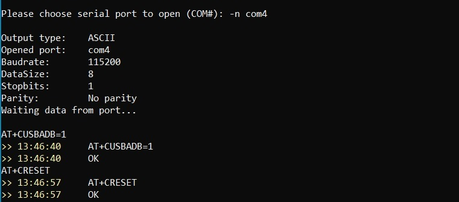

# __Дополнения и настройки SDK__

## Патч SDK
```sh
# Запуск скрипта для добавления библиотек и настроек образа
./patch.sh 
# libconfig installation ..
# libprotobuf installation ..
# libamqpcpp installation ..
# [+] Toolchain patch succeed
# [+] Img rootfs patch succeed
# [+] Img usrfs patch succeed
# [OK] SDK patch finished
```

## Автостарт приложений
Модуль поддерживает систему запуска __SysV-Init__ (init.d + rcS)  

```sh
# Добавляем скрипт запуска приложения в /etc/init.d
sudo cp ./target/rc/start_autostart ../../sim_open_sdk/sim_rootfs/etc/init.d/
# На уровне запуска rc5 создаем симлинк 
cd ../../sim_open_sdk/sim_rootfs/etc/rc5.d/
sudo ln -sf ../init.d/start_autostart ./S99start_autostart
# Пересобираем rootfs модуля из директории sim_open_sdk
cd ../../../ && make rootfs 
```
После пересборки должен появиться новый образ `sim_open_sdk/output/system.img`.

## Редактирование размеров разделов
В файле настроек разделов монтирования можно регулировать занимаемые объемы пользовательскими разделами `/data` и `/cache`:

```sh
nano ../../sim_open_sdk/tools/ubinize_system_userdata.cfg
```
Редактируем `[cache_volume] vol_size=..MiB` (по умолчанию `/cache` предоставлено 45 МБ). Выставляем 30. Оставшееся (55 - 30 = 25) будет выделено под раздел `/data`

```sh
# Пересобираем rootfs модуля из директории sim_open_sdk
cd ../../sim_open_sdk/ && make rootfs
```
Собранный образ располагается в `sim_open_sdk/output/system.img`

## Редактирование содержмого userfs
Чтобы создать директории для приложений, воссоздаем нужные каталоги в `sim_open_sdk/sim_usrfs`. Это будет соответствовать разделу `/data` внутри модуля.

```sh
# Помечаем, что хотим создать в модуле директорию /data/autoinformer
mkdir ../../sim_open_sdk/sim_usrfs/autoinformer
cp ../scripts/autostart.sh ../../sim_open_sdk/sim_usrfs/autoinformer/
chmod +x ../../sim_open_sdk/sim_usrfs/autoinformer/autostart.sh
# Пересобираем rootfs модуля из директории sim_open_sdk
cd ../../sim_open_sdk/ && make rootfs
```

## Добавление библиотек и утилит
Динамические библотеки внутри модуля располагаются в `/lib` и `/usr/lib` и входят в состав __rootfs__ соответственно.  
Чтобы добавить библитеки в эти директории необходимо расположить их в 

* `../../sim_open_sdk/sim_rootfs/usr/lib/` - добавление в состав rootfs модуля (не рекомендуется)

однако так будет расходоваться место в __rootfs__, которого и так мало. Таким образом, сторонние библиотеки (которых нет в составе SDK) предлагается хранить в __usrfs__ по пути `/data/lib` и линковать приложения с флагом `-Wl,-rpath,/data/lib`. 

```sh
# Создаем директорию для хранения пользовательских библиотек
mkdir ../../sim_open_sdk/sim_usrfs/lib
# Теперь сюда можно будет класть .so файлы
cp ./target/libtest.so.1.0.0 ../../sim_open_sdk/sim_usrfs/lib
cd ../../sim_open_sdk/sim_usrfs/lib
chmod +x libtest.so.1.0.0
ln -s libtest.so.1.0.0 libtest.so && ln -s libtest.so.1.0.0 libtest.so.1


# Во время отладки можно использовать ADB 
adb push libtest.so.1.0.0 /data/lib
adb shell 'cd /data/lib && chmod +x libtest.so.1.0.0 && ln -s libtest.so.1.0.0 libtest.so && ln -s libtest.so.1.0.0 libtest.so.1'
```

Для кросс-компиляции новые библиотеки должны расположиться в следующих директориях:

* `../../sim_open_sdk/sim_crosscompile/sysroots/mdm9607-perf/usr/lib/`  - `.so`, `.a`, `.la` 
* `../../sim_open_sdk/sim_crosscompile/sysroots/mdm9607-perf/usr/include/` - `.h`, `.hh` 


## Прошивка модуля новым образом
Образ `system.img` можно загрузить в модуль при помощи __ADB FastBoot__:

```sh
# вызов загрузчика
adb reboot bootloader
# загржаемый образ лежит по пути B:\system.img
fastboot flash system B:\system.img
# Sending 'system' (50432 KB)                        OKAY [  1.617s]
# Writing 'system'                                   OKAY [ 19.017s]
# Finished. Total time: 20.652s
fastboot reboot
# Rebooting                                          OKAY [  0.005s]
# Finished. Total time: 0.006s
```


После этого нужно будет снова открыть ADB порт АТ-командами

```sh
AT+CUSBADB=1
AT+CRESET
```



